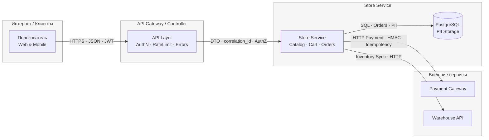

# TM - Требования безопасности + Модель угроз + ADR

> Этот файл - **индивидуальный**. Его проверяют по **rubric_TM.md** (5 критериев × {0/1/2} → 0-10).
> Подсказки помечены `TODO:` - удалите после заполнения.
> Все доказательства/скрины кладите в **EVIDENCE/** и ссылайтесь на конкретные файлы/якоря.

---

## 0) Мета

- **Проект (опционально BYO):** Учебный шаблон (интернет-магазин)
- **Версия (commit/date):** 2025-11-30
- **Кратко (1-2 предложения):** Система представляет собой сервис интернет-магазина с регистрацией пользователей, оформлением заказов и интеграцией с внешними платёжными и складскими сервисами. Пользователи — клиенты (web/mobile), а также администраторы, управляющие товарами и заказами.

---

## 1) Архитектура и границы доверия (TM1, S04)

### Роли и активы

**Роли:**

- **Пользователь (Client/User)** — оформляет регистрацию, авторизацию, работу с корзиной и заказами.
- **Администратор (Admin)** — управляет товарами, складами, акциями; имеет расширенные права.
- **Сервисные учётки** — внутренние сервисы для взаимодействия друг с другом (Store→DB, Store→Payment, Store→Warehouse).

**Активы:**

- Персональные данные пользователей (PII): email, phone.
- Учетные данные (JWT access/refresh tokens).
- Данные заказов и корзины.
- Платежные данные (tokenized).
- Логи и метрики (включают correlation_id).
- Конфигурации и секреты сервисов.

---

### Зоны/границы доверия

- **Интернет (Untrusted):**Браузеры и мобильные клиенты. Все запросы считаются недоверенными, требуют валидации, rate-limit, аутентификации.
- **Frontend/API Gateway (DMZ):**Первый компонент внутреннего контура. Ограниченно доверенная зона: сюда могут прийти и валидные, и злонамеренные запросы. Здесь реализуются:

  - проверка JWT,
  - rate-limit,
  - error contract (RFC7807),
  - корреляция запросов (X-Correlation-ID).
- **Service Layer (Trusted but controlled):**Store Service (Catalog, Cart, Orders).Потоки считаются частично доверенными, но необходима:

  - авторизация (RBAC/tenant),
  - защита от тамперинга DTO,
  - параметризация SQL,
  - защита PII.
- **Data Layer (Highly sensitive):**PostgreSQL. Хранит PII, данные заказов.Доступ только через сервисный аккаунт с минимальными правами.
- **External Integration Zone:**

  - Payment gateway — недоверенный до криптографической проверки подписи.
  - Warehouse API — частично доверенный, но нестабильный (timeouts/retry/CB).

---

### Context/DFD (уровень TM)

---

### Критичные интерфейсы

1. **Internet → API Gateway**

   Наиболее опасный периметр. Угрозы: bruteforce, tampering, PII exposure, DoS.

   Требования: JWT AuthN, rate-limit, валидация тела, error contract.
2. **API Gateway → Store Service**

   Полудоверенный трафик.

   Требования: сервисная аутентификация, проверка Tenant/AuthZ, защита DTO от tampering.
3. **Store Service → PostgreSQL**

   Самый чувствительный актив — PII и заказы.

   Требования: параметризованные SQL, canonicalization, минимальные права, audit.
4. **External → Store Service (Payment Webhooks)**

   Недоверенные внешние вызовы.

   Требования: подпись HMAC, idempotency keys, timeouts + retry + circuit breaker.

---

### Допущения

* Все токены клиентов — JWT; refresh хранится только у клиента.
* Internal network частично доверенная, но требует service-to-service authentication.
* Платёжные данные не хранятся — только токены/ID от провайдера.
* Все сервисы логируют JSON + correlation_id.
* Все секреты хранятся в env/KMS, отсутствуют в репозитории.

---

## 2) Реестр угроз STRIDE (TM2, TM3, S04)

Ниже — консолидированная таблица угроз по узлам и потокам DFD.
Все категории STRIDE покрыты, угрозы доменно-специфичны (e-commerce, платежи, PII).

| ID   | STRIDE      | Компонент / Поток      | Угроза (краткое описание)                                                                                                                                                    | L | I | L×I |
| ---- | ----------- | ------------------------------------ | ------------------------------------------------------------------------------------------------------------------------------------------------------------------------------------------------- | -: | -: | ---: |
| R-01 | **I** | Store Service → PostgreSQL          | **Массовая утечка PII** через SQL-инъекцию, неправильную нормализацию или логирование сырых PII.                      | 4 | 5 |   20 |
| R-02 | **S** | Client → Auth Service               | **Захват аккаунта (ATO)**: кража или перебор пароля/JWT, фишинг, повторное использование украденного токена | 4 | 5 |   20 |
| R-03 | **T** | Gateway → Store Service             | **Tampering DTO**: изменение полей (цены/кол-ва/owner_id) до бизнес-логики, IDOR-подмена идентификаторов                         | 4 | 4 |   16 |
| R-04 | **I** | Gateway → Client (API Response)     | **PII Exposure**: возврат email/phone/address в ответах, утечка через stacktrace или неправильный error flow                                       | 4 | 4 |   16 |
| R-05 | **D** | Client → API Gateway                | **DoS / Resource exhaustion**: массовые POST-запросы, обход rate-limit, payload > limit                                                                                 | 4 | 3 |   12 |
| R-06 | **S** | External → Store Service (Webhooks) | **Spoofing Payment Gateway**: фальшивый webhook без подписи или с подделанным HMAC                                                                        | 3 | 4 |   12 |
| R-07 | **T** | Store Service → Payment Gateway     | **Tampering Payment Request**: подмена суммы платежа, currency или order_id                                                                                           | 3 | 4 |   12 |
| R-08 | **R** | Store Service (Business Actions)     | **Repudiation**: отсутствие аудита изменения статуса заказа/аккаунта                                                                          | 3 | 3 |    9 |
| R-09 | **E** | Gateway ↔ Store Service (AuthZ)     | **Elevation of Privilege / IDOR**: пользователь запрашивает чужие ресурсы                                                                                | 3 | 4 |   12 |
| R-10 | **D** | Store Service → Warehouse API       | **Зависание внешнего API**: истощение воркеров, рост latency, блокировка заказов                                                     | 3 | 3 |    9 |

---

### Пояснения по доменно-специфичным угрозам

**E-commerce специфичные угрозы:**

- Подмена цены в DTO (Tampering).
- Подмена количества товаров перед оплатой.
- IDOR-доступ к чужой корзине/заказу.
- Подделка статуса платежа через фальшивые webhooks.
- Утечка PII через публичные API (часто встречается при ошибках в сериализации).
- Склады, платежи → нестабильные внешние интеграции → угрозы D/T.

**PII/Financial threats (регуляторно значимые):**

- Утечка персональных данных (I).
- Подмена финансовых параметров заказа (T).
- Утечка платежных данных (I).
- Отрицание действий администратора (R).

**Соответствие STRIDE:**

- S: ATO, spoofed webhooks, spoofing JWT
- T: tampering DTO, подмена параметров платежа
- R: отсутствие аудита
- I: PII exposure, DB leak
- D: DoS, зависания внешних сервисов
- E: IDOR, обход RBAC

---

## 3) Приоритизация и Top-5 (TM3, S04)

Приоритизация выполнена по модели L×I (1–5), затем — тай-брейкеры
(blast radius, detectability, compliance, dependency risk).

### Top-5 рисков

### **Top-1: R-01 — Массовая утечка PII (Score 20 = 4×5)**

**Почему #1:**

- Максимальный импакт (I=5): затрагивает все учетные записи → GDPR/152-ФЗ риски.
- Высокая вероятность (L=4): есть SQL-слой, есть обработка PII, есть vectors через API/logs.
- Blast radius: **вся БД**.
- Detectability низкая: утечки из логов/дампов часто долго незаметны.

### **Top-2: R-02 — Захват аккаунта (Spoofing/ATO) (Score 20 = 4×5)**

**Почему ниже R-01:**

- Хотя Score одинаковый, blast radius меньше (компрометация аккаунтов, не всей БД).
- Detectability выше (аномалии логинов фиксируются быстрее).
- Однако экспозиция максимальная: самый атакуемый публичный контур.

### **Top-3: R-03 — Tampering DTO / IDOR / подмена идентификаторов (Score 16 = 4×4)**

**Почему #3:**

- Частая уязвимость e-commerce (IDOR, tampering price/quantity).
- Импакт значимый (финансовые потери, чужие заказы).
- Экспозиция высокая — весь публичный API поверх DTO.
- Blast radius ограничен tenant/пользователем → ниже, чем у PII/ATO.

### **Top-4: R-04 — PII Exposure в API/ошибках (Score 16 = 4×4)**

**Почему ниже R-03:**

- Score равен, но импакт локальнее (утечка через API, а не из всей БД).
- Возможность обнаружения выше (логи/DAST тесты ловят leakage).
- Threat связан с ошибками сериализации/RFC7807/stacktrace.

### **Top-5: R-05 — DoS / Resource Exhaustion (Score 12 = 4×3)**

**Почему #5:**

- Высокая вероятность (public surface), но импакт ниже, чем у PII/ATO.
- Появляется деградация сервиса, но без утечек данных.
- Есть компенсирующие механизмы: rate-limit, WAF, autoscale.

### Тай-брейкеры, использованные при сортировке:

- **Blast radius:** R-01 > R-02 > R-03/R-04
- **Detectability:** PII DB leak < ATO < Tampering < API Leakage
- **Compliance impact:** PII leaks (R-01/04) выше, чем ATO или DoS
- **External exposure:** ATO/DoS самые публичные
- **Dependency risk:** платежи/warehouse не в Top-5 (ниже Score)

---

## 4) Требования (S03) и ADR-решения (S05) под Top-5 (TM4)

### NFR-1. Защита PII (NFR-006)

- **AC (GWT):**
  - **Given** DTO содержит PII (email/phone/address),**When** сервис пишет лог,**Then** PII маскированы; формат нормализован (E.164/NFC).
  - **Given** запись PII в БД,
    **When** выполняется INSERT/UPDATE,
    **Then** используются параметризованные SQL-запросы.

### NFR-2. Аутентификация и защита токенов (NFR-003)

- **AC (GWT):**
  - **Given** валидный JWT,**When** запрос к защищённому endpoint,**Then** `200` и корректный `X-User-Id`.
  - **Given** просроченный/поддельный токен,
    **When** запрос,
    **Then** `401` (RFC7807) + событие `auth.token_invalid`.

### NFR-3. Валидация DTO и защита от tampering (NFR-002)

- **AC (GWT):**
  - **Given** тело > 1MiB или содержит лишние поля,**When** POST /api/...**Then** `400/413` по RFC7807.
  - **Given** пользователь запрашивает чужой ресурс,
    **When** /api/orders/{id}
    **Then** `403/404` без утечки данных.

### NFR-4. Ошибки API без утечки данных (NFR-009)

- **AC (GWT):**
  - **Given** внутренняя ошибка,
    **When** сервис формирует ответ,
    **Then** формат RFC7807, без stacktrace, correlation_id в теле.

### NFR-5. Лимиты/таймауты для защиты от DoS (NFR-007)

- **AC (GWT):**
  - **Given** клиент превышает лимит,**When** > N rps,**Then** `429` + корректный `Retry-After`.
  - **Given** зависание внешнего API,
    **When** timeout > T сек,
    **Then** запрос отменён; событие `ext.timeout`.

---

### Краткие ADR (минимум 2) - архитектурные решения S05

### **ADR-001 — SQL Injection Protection**

#### [ADR-001 - SQL Injection Protection](../SEMINARS/S05/S05_ADR_sql_injection_protection.md)

- **Context (угрозы/NFR):** R-01; NFR-1; контур StoreService→DB
- **Decision:** параметризованные SQL, канонизация данных, запрет динамических SQL; шифрование PII на уровне колонок
- **Trade-offs:** небольшое усложнение миграций и сериализации
- **DoD:**
  - тест: `sql_injection_test` → всегда PASS
  - лог: отсутствие сырых PII в логах
  - скан: Trivy/SAST → 0 SQLi findings
- **Owner:** backend-team
- **Evidence:** `EVIDENCE/db-sast-report.json`

---

### **ADR-002 — Auth Hardening**

#### [ADR-002 -  Auth Hardening](../SEMINARS/S05/S05_ADR_auth_hardening.md)

- **Context:** R-02; NFR-2; контур AUTH
- **Decision:** короткий TTL access-token, refresh-поток, проверка iss/aud/exp/nbf, rate-limit на логины, событие `auth.token_invalid`
- **Trade-offs:** возможное увеличение re-login частоты
- **DoD:**
  - > N логинов/мин → 429
    >
  - истёкший токен → 401 (RFC7807)
  - audit: запись `auth.token_invalid` создаётся
- **Owner:** backend-team
- **Evidence:** `EVIDENCE/dast-auth-tests.json`

---

### **ADR-003 — PII Protection**

#### [ADR-004 - PII Protection](../SEMINARS/S05/S05_ADR_pii_protection.md)

- **Context:** R-04 (PII Exposure in API Responses); NFR-1 (Privacy), NFR-4 (API Errors)
- **Decision:**

  - Маскирование PII в ответах API (email/phone/address).
  - Запрет включения PII в RFC7807 ошибок.
  - Логирование только маскированных полей (allowlist logging).
  - Ввод единого слоя нормализации/фильтрации DTO перед отправкой клиенту.
- **Trade-offs:**

  - Отладка сложнее — реальные PII не попадают в логи.
  - Требуется поддерживать список “разрешённых” полей и масок.
- **DoD:**

  - API возвращает маскированные значения:
    - email → `t***@mail.com`
    - phone → `+7********67`
    - address → `город + район`
  - Ошибки формата `application/problem+json` **не содержат PII**.
  - Логи не содержат сырых значений PII (проверяется grep).
  - Появляется audit-event: `pii_masked=true`.
- **Owner:** backend-team
- **Evidence:** `EVIDENCE/pii-masking-screenshot.png`, `EVIDENCE/log-pii-check.txt`

---

## 5) Трассировка Threat → NFR → ADR → (План)Проверки (TM5)

|  Threat (R-ID) | NFR           | ADR     | Чем проверяем (план/факт)                                                                                                                  |
| -------------: | ------------- | ------- | -------------------------------------------------------------------------------------------------------------------------------------------------------------- |
| **R-01** | NFR-1         | ADR-001 | SAST на SQLi + проверка маскировки PII →`EVIDENCE/sast-pii-sql-YYYY-MM-DD.json`; анализ логов (`EVIDENCE/log-samples.txt`) |
| **R-02** | NFR-2         | ADR-002 | DAST auth-flow (expired/invalid JWT) + событие `auth.token_invalid` → `EVIDENCE/dast-auth-tests.json`, `EVIDENCE/audit-auth.log`                 |
| **R-03** | NFR-2         | -       | Интеграционный IDOR-test + payload >1MiB →`EVIDENCE/idor-tests.log`, `EVIDENCE/validation-tests.json`                                       |
| **R-04** | NFR-4 , NFR-1 | ADR-004 | Проверка RFC7807 + отсутствие stacktrace/PII →`EVIDENCE/api-error-contract.png`; DAST leakage scan                                        |
| **R-05** | NFR-5         | -       | Нагрузочный тест (>N rps) + ожидание 429/Retry-After →`EVIDENCE/load-test-429.png`; CB-open event → `EVIDENCE/cb-metrics.json`    |

---

## 6) План проверок (мост в DV/DS)

- **SAST/Secrets/SCA:**Используем `Trivy` и `Gitleaks`.Отчёты сохраняем в:

  - `EVIDENCE/sast-pii-sql-YYYY-MM-DD.json`
  - `EVIDENCE/secrets-scan-YYYY-MM-DD.json`
- **SBOM:**Генерация SBOM с помощью `syft` (формат CycloneDX).Артефакт: `EVIDENCE/sbom-cyclonedx.json`
- **DAST:**Используем OWASP ZAP baseline против dev-стенда `/api/*`.Отчёт: `EVIDENCE/dast-baseline-report.html`
- **Load/Stress tests:**K6 (или locust) для проверки rate-limit + 429/Retry-After + timeout.Артефакты:

  - `EVIDENCE/load-test-429.png`
  - `EVIDENCE/cb-metrics.json`
- **Audit/Logs:**Проверка корректности создания событий (`auth.token_invalid`, `rate_limit_hit`, `idor_attempt`).Артефакт: `EVIDENCE/audit-log-samples.txt`
- **Примечание:**
  На стадии TM это план. Реальные файлы попадут в DV/DS на следующем этапе.

---

## 7) Самопроверка по рубрике TM (0/1/2)

- **TM1. Архитектура и границы доверия:** 2
- **TM2. Покрытие STRIDE и уместность угроз:** 2
- **TM3. Приоритизация и Top-5:** 2
- **TM4. NFR + ADR под Top-5:** 2
- **TM5. Трассировка → (план)проверок:** 2

**Итог TM (сумма):** 10/10
